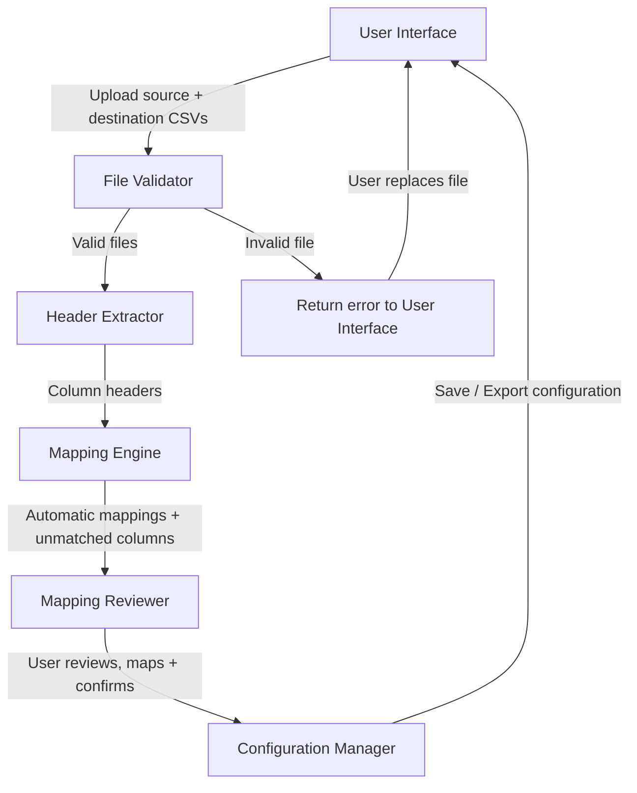

# Software Design Document
## 1. Project Overview

Smart Financial Mapper is a tool designed to help users map columns between different accounting systems during financial data migrations. Version 1 focuses on CSV files and supports both automatic exact-name matching and manual mapping. Users can review their mappings before saving or exporting the completed mapping configuration. Version 1 doesn't modify or migrate the underlying CSV data. The long-term aim is to reduce the time and risk involved in manually matching columns when companies migrate, upgrade, or consolidate financial systems.

## 2. Problem Statement

When organisations move financial data between accounting systems, the column names in the source and destination files often do not match. For example, one system may use Acct_Num while another uses Account_Number for the same information. Someone has to manually identify which columns correspond to each other. This process is time-consuming, repetitive, and prone to human error, especially during company acquisitions or system upgrades. The problem is made worse when staff must carry out this work alongside their normal responsibilities. 

## 3. Project Goals

- Reduce the time spent manually mapping columns between accounting systems.
- Minimise the risk of incorrect mappings during data migrations.
- Provide a clear and simple workflow that does not require technical knowledge of file formats.
- Deliver a working Version 1 that supports CSV files with exact-name matching and manual mapping.
- Design the system so that more advanced matching and additional file formats can be added later without major rewrites.

## 4. Stakeholders

- **Primary users** - Accountants, finance staff, and data migration specialists who need to map columns between systems.
- **Secondary users** - IT staff or consultants supporting financial system migrations.
- **Organisations undergoing financial system migrations** - Have an interest in ensuring financial data is mapped accurately, securely, and efficiently.
- **Project owner/developer** - Responsible for the design, development, and maintenance of the tool.

## 5. User Workflow 
### Main Workflow (Successful CSV Mapping)

1. **Upload source and destination CSV files**
- The user uploads the two CSV files they want to compare and map.
2. **Validate uploaded files**
- The system checks that:
 - Files are in a supported format
 - Files are not empty
 - Files can be read successfully
 - Required structure is present
3. **Extract column headers**
- The system reads both files and identifies their column names.
4. **Display column headers for comparison**
- The system displays the source and destination columns side by side so the user can compare their structures.
5. **Automatically match identical column names**
- The system identifies columns with exact matching names and suggests these as mappings.
6. **Manually map remaining unmatched columns**
- The user reviews unmatched columns and manually selects the corresponding destination column for each.
7. **Review mappings**
- The user reviews all automatic and manual mappings before saving.
8. **Save and export mapping configuration**
- The system saves the completed mapping configuration for future use, before being exported.

### Alternative Workflow (Invalid File Upload)

1. **Upload source and destination CSV files**
2. **Validate uploaded files**
- The system checks that the uploaded files are valid and can be processed.
3. **Validation fails**
- The system detects one or more validation errors:
 - Unsupported file type
 - Empty file
 - Corrupted file
 - Missing column headers
4. **Display an error message**
- The system explains why the file cannot be processed.
5. **Allow the user to upload another file**
- The user selects a replacement file.
6. **Repeat Validation**
- The system validates the newly uploaded file before continuing with the main workflow.

## 6. Functional Requirements

The following describes the functionality planned for Version 1 of Smart Financial Mapper.

**FR01 File Upload**

The system shall allow users to upload a source CSV file and a destination CSV file.

**FR02 File Validation**

The system shall validate uploaded files before processing.

**FR03 Invalid File Rejection**

The system shall reject unsupported, corrupted, unreadable, or empty files.

**FR04 Validation Error Message**

The system shall display an error message explaining why an uploaded file was rejected.

**FR05 File Replacement**

The system shall allow users to replace a rejected file and attempt to re-upload.

**FR06 Column Header Extraction**

The system shall identify and extract column headers from both CSV files.

**FR07 Column Header Display**

The system shall display the extracted source and destination column headers for comparison.

**FR08 Exact Header Comparison**

The system shall compare source and destination column headers to identify exact matches.

**FR09 Automatic Mapping**

The system shall automatically create mappings between columns with identical headers.

**FR10 Complete Automatic Mapping**

The system shall inform the user when no unmatched columns remain and allow them to proceed directly to the review stage.

**FR11 Manual Mapping**

The system shall allow users to manually map remaining unmatched source and destination columns.

**FR12 Duplicate Destination Prevention**

The system shall prevent multiple source columns from being mapped to the same destination column.

**FR13 Invalid Mapping Feedback**

The system shall display an error message when a user attempts to map a destination column that has already been mapped.

**FR14 Mapping Review**

The system shall allow users to review all mappings before saving or exporting them.

**FR15 Mapping Modification**

The system shall allow users to modify or remove automatically generated mappings during the review stage.

**FR16 Mapping Method Identification**

The system shall indicate whether each mapping was created automatically or manually.

**FR17 Save Mapping Configuration**

The system shall allow users to save a mapping configuration within the application for later use.

**FR18 Export Mapping Configuration**

The system shall allow users to export a completed mapping configuration to their computer.

## 7. Non-Functional Requirements

The following non-functional requirements define the expected quality, reliability, and maintainability of Version 1 of Smart Financial Mapper.

**NFR01 Processing Speed**

The system shall process supported CSV files within a reasonable amount of time.

**NFR02 Performance Targets**

Specific performance targets shall be defined after the initial CSV-processing functionality has been implemented and tested.

**NFR03 Ease of Use**

The system shall provide a clear and understandable workflow for users without requiring technical knowledge of CSV processing.

**NFR04 User Feedback**

The system shall provide clear feedback when an action is successful, fails, or requires further input from the user.

**NFR05 Error Handling**

The system shall handle invalid or unexpected input without causing the application to crash.

**NFR06 Progress Preservation**

The system shall preserve saved mapping configurations so users can return to them at a later time.

**NFR07 Mapping Integrity**

The system shall preserve confirmed mappings unless the user chooses to modify them.

**NFR08 Export Integrity**

The system shall ensure exported mapping configurations accurately reflect the mappings reviewed and confirmed by the user.

**NFR09 Data Protection**

The system shall protect uploaded financial data from unauthorised access.

**NFR10 Sensitive Data Handling**

The system shall avoid retaining sensitive uploaded data longer than necessary for the mapping process, unless storage is required for an explicitly supported feature.

**NFR11 Maintainable Structure**

The system shall be structured so that individual components can be modified, without requiring major changes to unrelated parts of the application.

**NFR12 Future Extensibility**

The system shall be designed so that future functionality such as intelligent matching, additional file formats and external accounting-system integrations, can be added without requiring the application to be rewritten.

## 8. System Architecture

## 9. Data Flow

## 10. Risks

**R01 - Incorrect automatic mappings**

Mitigated by a clear review step, visual distinction between automatic and manual mappings, and allowing users to modify or remove incorrect mappings before saving or exporting.

**R02 - Sensitive financial data retained for too long**

Mitigated by processing uploaded files without unnecessary persistent storage, saving only mapping configurations, and defining appropriate retention and deletion rules for any temporary data.

**R03 - Malformed or unexpected CSV files**

Mitigated by file validation, clear error messages, and allowing the user to replace invalid files.

**R04 - User makes incorrect manual mappings**

Mitigated by preventing duplicate destination mappings, allowing mappings to be modified or removed during review, and requiring confirmation before saving or exporting.

**R05 - Exact-name matching is too limited**

Accepted for Version 1. Manual mapping remains available, and the architecture is designed so more intelligent matching can be added later without major rewrites.

**R06 - Scope creep beyond Version 1**

Mitigated by clearly defined Version 1 boundaries and recording future features separately.

**R07 - Performance issues with large CSV files**

Mitigated by processing only the data required for Version 1, avoiding unnecessary retention of full row data, and testing with representative file sizes to establish performance targets.

**R08 - Unauthorised access to sensitive financial data** 

Mitigated by restricting access to uploaded data and saved configurations, securely handling sensitive data throughout processing, and ensuring that users can only access data they are authorised to view.

## 11. Future Features

**Intelligent column matching**

Use fuzzy matching, similarity scoring, or machine-learning techniques to suggest mappings for columns with different but related names.

**Improved guidance for unmatched columns**

Provide clearer suggestions or side-by-side sample data to help users make better manual mapping decisions.

**Multilingual column matching**

Allow the mapping engine to recognise equivalent column meanings across different languages, helping users map files produced by international accounting systems.

**Reusable mapping templates**

Extend saved mapping configurations into named templates that can be organised and reused across clients, systems, or repeated migration processes.

**Mapping history and audit trails**

Keep a record of previous mapping sessions so users can review or restore earlier configurations.

**Support for additional file formats**

Accept Excel (.xlsx), fixed-width, and other common accounting export formats in addition to CSV.

**Basic data transformation rules**

Support simple transformations during mapping (e.g. trimming whitespace, changing date formats, concatenating fields).

**Apply mappings to underlying data**

Use a completed mapping configuration to transform source data into the destination structure and generate a migrated output file.

**Multilingual interface**

Support multiple interface languages so the application can be used more easily by users in different countries and organisations.

**Integration with accounting systems**

Direct connectors or import/export support for popular accounting platforms to reduce the need for manual file handling.

## 12. Appendix/Design Notes

Open Design Decisions